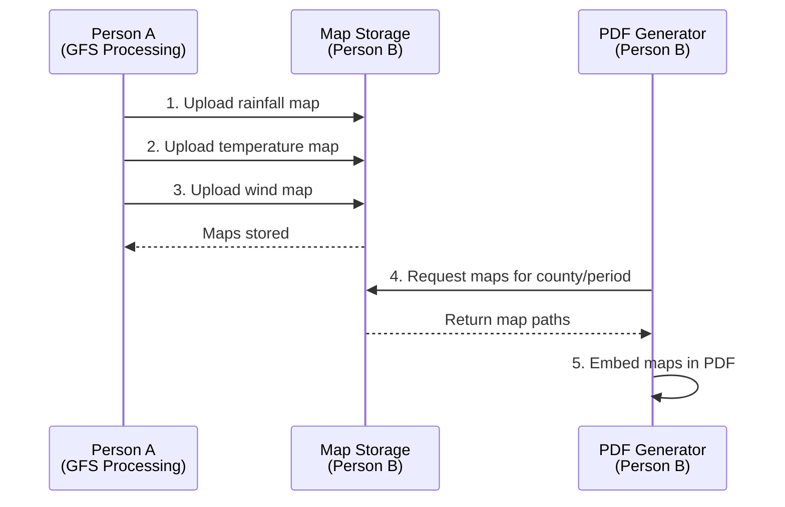

# Map Integration Guide

**Integration Contract between Person A (GFS Processing) and Person B (Application/PDF)**

This document defines how Person A's geospatial processing pipeline integrates with Person B's map storage and PDF generation systems.

---

## Overview



---

## File Specifications

### Image Format Requirements

| Property | Specification | Example |
|----------|--------------|---------|
| **Format** | PNG (primary), SVG (optional) | `rainfall_map.png` |
| **Resolution** | 1200 x 900 pixels | Width: 1200px, Height: 900px |
| **DPI** | 300 (print quality) | 300 DPI |
| **Color Mode** | RGB | 24-bit color |
| **File Size** | < 2 MB recommended | Compress if needed |
| **Naming** | `{county_id}_{variable}_{start}_{end}.png` | `31_rainfall_2026-01-27_2026-02-02.png` |

### Required Variables

Person A must generate **3 maps per county per week**:

1. **Rainfall Distribution Map**
   - Variable name: `rainfall`
   - Shows ward-level rainfall accumulation (mm)
   - Color scale: WMO-compliant (blues)

2. **Temperature Distribution Map**
   - Variable name: `temperature`
   - Shows ward-level temperature (°C)
   - Color scale: WMO-compliant (blue-yellow-red)

3. **Wind Speed Distribution Map**
   - Variable name: `wind`
   - Shows ward-level wind speeds (km/h)
   - Color scale: WMO-compliant (greens-yellows)

---

## Storage Directory Structure

Maps are automatically organized by county, year, and week:

```
data/maps/
├── {county_id}/
│   ├── {year}/
│   │   ├── {week}/
│   │   │   ├── {county_id}_rainfall_{start}_{end}.png
│   │   │   ├── {county_id}_temperature_{start}_{end}.png
│   │   │   ├── {county_id}_wind_{start}_{end}.png
│   │   │   ├── {county_id}_rainfall_{start}_{end}.meta.json
│   │   │   ├── {county_id}_temperature_{start}_{end}.meta.json
│   │   │   └── {county_id}_wind_{start}_{end}.meta.json
```

**Example for Nairobi County, Week 5, 2026**:
```
data/maps/31/2026/05/
├── 31_rainfall_2026-01-27_2026-02-02.png
├── 31_rainfall_2026-01-27_2026-02-02.meta.json
├── 31_temperature_2026-01-27_2026-02-02.png
├── 31_temperature_2026-01-27_2026-02-02.meta.json
├── 31_wind_2026-01-27_2026-02-02.png
└── 31_wind_2026-01-27_2026-02-02.meta.json
```

---

## API Endpoints for Person A

### Base URL

```
http://localhost:8000/api/v1/maps
```

### 1. Upload a Map

**Endpoint**: `POST /api/v1/maps/upload`

**Purpose**: Upload a generated weather map image.

**Request Format**:
```bash
curl -X POST "http://localhost:8000/api/v1/maps/upload" \
  -F "county_id=31" \
  -F "variable=rainfall" \
  -F "period_start=2026-01-27" \
  -F "period_end=2026-02-02" \
  -F "resolution_dpi=300" \
  -F "width_px=1200" \
  -F "height_px=900" \
  -F "file=@/path/to/nairobi_rainfall.png"
```

**Python Example**:
```python
import requests
from pathlib import Path

def upload_map(
    county_id: str,
    variable: str,
    period_start: str,
    period_end: str,
    map_file_path: Path
):
    """Upload a map to the storage service."""
    url = "http://localhost:8000/api/v1/maps/upload"
    
    with open(map_file_path, 'rb') as f:
        files = {'file': f}
        data = {
            'county_id': county_id,
            'variable': variable,
            'period_start': period_start,
            'period_end': period_end,
            'resolution_dpi': 300,
            'width_px': 1200,
            'height_px': 900,
            'format': 'png'
        }
        
        response = requests.post(url, files=files, data=data)
        response.raise_for_status()
        
        return response.json()

# Usage
upload_map(
    county_id="31",
    variable="rainfall",
    period_start="2026-01-27",
    period_end="2026-02-02",
    map_file_path=Path("output/nairobi_rainfall.png")
)
```

**Response** (201 Created):
```json
{
  "message": "Map uploaded successfully",
  "map": {
    "county_id": "31",
    "variable": "rainfall",
    "period_start": "2026-01-27",
    "period_end": "2026-02-02",
    "file_path": "/path/to/data/maps/31/2026/05/31_rainfall_2026-01-27_2026-02-02.png",
    "format": "png",
    "resolution_dpi": 300,
    "width_px": 1200,
    "height_px": 900,
    "generated_at": "2026-01-27T03:15:00Z"
  }
}
```

### 2. Batch Upload Script

For uploading all 3 maps for a county:

```python
def upload_county_maps(
    county_id: str,
    county_name: str,
    period_start: str,
    period_end: str,
    output_dir: Path
):
    """Upload all maps for a county."""
    variables = ['rainfall', 'temperature', 'wind']
    
    for variable in variables:
        map_file = output_dir / f"{county_id}_{variable}_{period_start}_{period_end}.png"
        
        if not map_file.exists():
            print(f"⚠️  Warning: Map not found: {map_file}")
            continue
        
        try:
            result = upload_map(county_id, variable, period_start, period_end, map_file)
            print(f"✓ Uploaded {variable} map for {county_name}")
        except Exception as e:
            print(f"✗ Failed to upload {variable} map: {e}")
```

### 3. Check if Map Exists

**Endpoint**: `GET /api/v1/maps/{county_id}/{variable}`

**Query Parameters**:
- `period_start`: ISO date (YYYY-MM-DD)
- `period_end`: ISO date (YYYY-MM-DD)

**Example**:
```bash
curl "http://localhost:8000/api/v1/maps/31/rainfall?period_start=2026-01-27&period_end=2026-02-02"
```

**Response** (200 OK if found):
```json
{
  "county_id": "31",
  "variable": "rainfall",
  "period_start": "2026-01-27",
  "period_end": "2026-02-02",
  "file_path": "...",
  "format": "png",
  "generated_at": "2026-01-27T03:15:00Z"
}
```

**Response** (404 if not found):
```json
{
  "detail": "Map not found for 31/rainfall/2026-01-27/2026-02-02"
}
```

---

## Map Content Requirements

### Color Scales (WMO-Compliant)

**Rainfall** (Blues):
```
0-10mm     → #e0f2fe (very light blue)
10-20mm    → #7dd3fc (light blue)
20-30mm    → #38bdf8 (medium blue)
30-50mm    → #0284c7 (blue)
50-100mm   → #0c4a6e (dark blue)
100mm+     → #082f49 (very dark blue)
```

**Temperature** (Blue-Yellow-Red):
```
<10°C      → #3b82f6 (blue)
10-15°C    → #22d3ee (cyan)
15-20°C    → #10b981 (green)
20-25°C    → #fbbf24 (yellow)
25-30°C    → #f97316 (orange)
30°C+      → #ef4444 (red)
```

**Wind Speed** (Greens-Yellows):
```
0-10 km/h  → #d1fae5 (very light green)
10-15 km/h → #86efac (light green)
15-20 km/h → #4ade80 (green)
20-30 km/h → #fde047 (yellow)
30-40 km/h → #f97316 (orange)
40+ km/h   → #ef4444 (red)
```

### Required Map Elements

Each map must include:

1. **Title**: County name + variable (e.g., "Nairobi - Rainfall Distribution")
2. **Period**: Week dates (e.g., "Jan 27 - Feb 2, 2026")
3. **Color Legend**: With scale and units
4. **Ward Boundaries**: Clearly visible ward delineations
5. **Ward Labels**: Optional but helpful (major wards)
6. **North Arrow**: Standard cartographic north indicator
7. **Scale Bar**: Distance scale in kilometers
8. **Data Source**: "GFS 0.25°" or similar
9. **Coordinate System**: EPSG:4326 or EPSG:32637 (UTM 37N for Kenya)

---

## Metadata JSON Format

Each map has an accompanying `.meta.json` file with additional context:

```json
{
  "county_id": "31",
  "variable": "rainfall",
  "period_start": "2026-01-27",
  "period_end": "2026-02-02",
  "file_path": "/data/maps/31/2026/05/31_rainfall_2026-01-27_2026-02-02.png",
  "format": "png",
  "resolution_dpi": 300,
  "width_px": 1200,
  "height_px": 900,
  "generated_at": "2026-01-27T03:15:00Z",
  "bounds": {
    "min_lon": 36.6,
    "max_lon": 37.1,
    "min_lat": -1.5,
    "max_lat": -1.1
  },
  "quality_flags": [],
  "grid_points_used": 184,
  "projection": "EPSG:4326"
}
```

---

## Error Handling

### Upload Errors

| Error Code | Meaning | Action |
|------------|---------|--------|
| 400 | Invalid county_id or date format | Check input format |
| 413 | File too large (>10MB) | Compress image |
| 500 | Storage failure | Retry upload, check disk space |

### Retry Logic

```python
import time
from requests.adapters import HTTPAdapter
from requests.packages.urllib3.util.retry import Retry

def create_session_with_retries():
    """Create HTTP session with automatic retries."""
    session = requests.Session()
    
    retry_strategy = Retry(
        total=3,
        backoff_factor=1,
        status_forcelist=[429, 500, 502, 503, 504],
        allowed_methods=["POST", "GET"]
    )
    
    adapter = HTTPAdapter(max_retries=retry_strategy)
    session.mount("http://", adapter)
    session.mount("https://", adapter)
    
    return session
```

---

## Testing with Mock Maps

Mock placeholder maps are provided for testing:

```bash
# Location
/home/lnz/DEV/clima-scope/data/maps/mock/

# Available mocks
31_rainfall_mock.png
31_temperature_mock.png
31_wind_mock.png
... (for counties 01, 23, 32, 42)
```

**Test Upload**:
```bash
curl -X POST "http://localhost:8000/api/v1/maps/upload" \
  -F "county_id=31" \
  -F "variable=rainfall" \
  -F "period_start=2026-01-27" \
  -F "period_end=2026-02-02" \
  -F "file=@data/maps/mock/31_rainfall_mock.png"
```

---

## Integration Checklist

**Person A must ensure**:

- [ ] Maps generated in PNG format (1200x900, 300 DPI)
- [ ] WMO-compliant color scales used
- [ ] All 3 maps (rainfall, temperature, wind) generated per county
- [ ] File naming follows convention
- [ ] Upload API endpoint integrated into pipeline
- [ ] Error handling and retries implemented
- [ ] Metadata includes geographic bounds
- [ ] Maps include legend, scale, and labels

**Person B provides**:

- [x] Map storage service with automatic organization
- [x] Upload API endpoint with validation
- [x] PDF builder with map embedding support
- [x] Fallback handling for missing maps
- [x] Mock maps for testing
- [x] Integration documentation

---

## Support & Debugging

### Logs

Map storage operations are logged with structured logging:

```python
# Person A can check logs for upload status
logger.info("map_uploaded", county_id="31", variable="rainfall", size_bytes=1234567)
logger.info("map_stored", dest_path="/data/maps/31/2026/05/...")
```

### Shared Error Codes

To distinguish between Person A and Person B errors:

- **A-xxx**: Person A errors (GFS processing, map generation)
- **B-xxx**: Person B errors (storage, PDF generation, API)

Example:
```
A-001: GFS data download failed
A-002: Spatial aggregation error
A-003: Map rendering failed

B-001: Map storage disk full
B-002: PDF generation timeout
B-003: Map file not found
```

### Contact Points

- **Person A (GFS Processing)**: [Email/Slack]
- **Person B (Application/Reporting)**: [Email/Slack]
- **Shared Documentation**: `docs/MAP_INTEGRATION.md`
- **Integration Tests**: `backend/tests/integration/test_map_integration.py`

---

## Timeline

| Milestone | Person A | Person B | Status |
|-----------|----------|----------|--------|
| Map specifications defined | ✓ Review specs | ✓ Define specs | **COMPLETE** |
| Mock maps created | - | ✓ Create mocks | **COMPLETE** |
| Upload API tested | Test with mocks | ✓ Implement API | **COMPLETE** |
| GFS pipeline generates maps | Implement | - | **PENDING** |
| End-to-end integration test | Upload real maps | Embed in PDF | **PENDING** |
| Production deployment | Deploy | Deploy | **PENDING** |

---

## Next Steps

1. **Person A**: Implement map generation in GFS processing pipeline
2. **Person A**: Test uploads using mock maps
3. **Both**: Run integration test with real GFS data
4. **Person B**: Verify PDF generation with embedded maps
5. **Both**: Performance testing (47 counties × 3 maps = 141 files/week)
