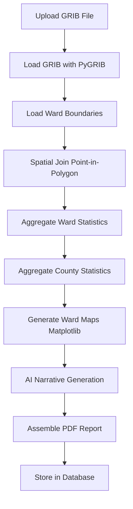

# Clima-scope Master Implementation Plan

## Executive Summary

Clima-scope automates weekly meteorological reporting for Kenya's 47 counties. The system ingests GFS forecast data, performs ward-level spatial aggregation, generates AI-powered narratives, and produces professional PDF reports with embedded maps.

**Business Goal**: Replace manual 2-3 day reporting process with automated <1 hour pipeline

**Technical Scope**: Full-stack system with geospatial processing, AI integration, and multi-user dashboard

---

## Current Progress Assessment

### Foundation Complete (60% of infrastructure)

**Backend API** ✅

- FastAPI application running
- 5 database models (County, Ward, WeatherReport, CompleteReport, PDFReport)
- Core CRUD endpoints operational
- PostgreSQL + Alembic migrations
- 47 counties seeded with KNBS codes
- Structured logging (structlog)

**PDF Generator** ✅

- 11-section report structure
- AI integration (OpenAI/Anthropic)
- ReportLab-based builders (basic + enhanced)
- Narrative generation working
- Sample Nairobi PDF generated

**Frontend UI** ✅

- Next.js 16 + React 19 + TypeScript
- 7 dashboard screens implemented
- Forms for report generation, data upload, configuration
- Mock data throughout (NOT connected to backend)

**Documentation** ✅

- Comprehensive specs (4 docs in docs/)
- JSON Schema (Draft 7)
- TypeScript interfaces
- API documentation

### Critical Missing Components (40% - Core Business Value)

**GFS Data Processing** ❌ CRITICAL

- No GRIB file ingestion
- No PyGRIB integration
- No xarray data loading
- **Impact**: Cannot process actual forecast data

**Spatial Aggregation** ❌ CRITICAL

- No GeoPandas implementation
- No point-in-polygon aggregation
- No ward-level statistics
- **Impact**: Cannot create ward-level forecasts

**Map Generation** ❌ CRITICAL

- Stubbed in pdf_generator
- No Matplotlib/Cartopy implementation
- No choropleth maps
- **Impact**: PDFs missing key visualizations

**Data Upload Endpoints** ❌

- Frontend UI exists
- Backend endpoints missing
- No shapefile processing
- No GRIB upload handling

**Frontend-Backend Integration** ❌

- API client not implemented
- Authentication not connected
- All data is mock/hardcoded

---

## Implementation Roadmap

### Phase 4: GFS Data Processing (CRITICAL - Week 1)

**Priority**: HIGHEST - This is the data source for everything

#### Task 4.1: GFS Data Ingestion Module

Create new module for GRIB processing:

**Files to Create**:

```
backend/app/services/gfs_processor.py
backend/app/services/grib_loader.py  
backend/app/schemas/gfs.py
```

**Implementation**:

```python
# app/services/grib_loader.py

import pygrib
import xarray as xr
from typing import Dict, List
from datetime import datetime

class GFSLoader:
    """Load and parse GFS GRIB files."""
    
    def load_grib_file(self, file_path: str) -> Dict:
        """
        Load GFS GRIB file and extract variables.
        
        Variables:
    - total_precipitation (apcpsfc)
    - 2m temperature (t2m)
    - 10m wind components (u10m, v10m)
        """
        grbs = pygrib.open(file_path)
        
        # Extract variables
        precip = grbs.select(name='Total Precipitation')[0]
        temp = grbs.select(name='2 metre temperature')[0]
        u_wind = grbs.select(name='10 metre U wind component')[0]
        v_wind = grbs.select(name='10 metre V wind component')[0]
        
        return {
            'precipitation': precip.values,
            'temperature': temp.values,
            'u_wind': u_wind.values,
            'v_wind': v_wind.values,
            'lats': precip.latlons()[0],
            'lons': precip.latlons()[1],
            'forecast_time': precip.validDate
        }
```

**Dependencies to Add**:

```txt
# requirements.txt
pygrib==2.1.5
xarray==2024.1.0
cfgrib==0.10.0
netCDF4==1.6.5
```

#### Task 4.2: Data Upload Endpoints

Match frontend screens:

```python
# app/api/v1/data_upload.py

@router.post("/upload/grib", tags=["data-upload"])
async def upload_grib_file(
    file: UploadFile,
    county_id: str,
    forecast_date: date,
    background_tasks: BackgroundTasks,
    db: Session = Depends(get_db)
):
    """
    Upload GFS GRIB file for processing.
    Matches frontend: Data Upload screen
    """
    # 1. Validate file format
    # 2. Save to storage
    # 3. Queue processing task
    # 4. Return job ID

@router.post("/upload/shapefile", tags=["data-upload"])
async def upload_shapefile(
    files: List[UploadFile],  # .shp, .shx, .dbf, .prj
    boundary_type: str,  # "county" | "ward"
    db: Session = Depends(get_db)
):
    """Upload county/ward boundary shapefiles."""
```

**Files to Create**:

- [`backend/app/api/v1/data_upload.py`](backend/app/api/v1/data_upload.py)
- [`backend/app/schemas/upload.py`](backend/app/schemas/upload.py)

---

### Phase 5: Spatial Aggregation (CRITICAL - Week 1-2)

**Priority**: HIGHEST - Core technical requirement

#### Task 5.1: Spatial Processing Service

```python
# app/services/spatial_processor.py

import geopandas as gpd
from shapely.geometry import Point
from typing import Dict, List

class SpatialAggregator:
    """Aggregate GFS grid data to ward/county level."""
    
    def aggregate_to_wards(
        self, 
        gfs_data: Dict,
        ward_boundaries: gpd.GeoDataFrame
    ) -> Dict[str, Dict]:
        """
        Point-in-polygon aggregation.
        
        Returns: {
            "ward_id": {
                "rainfall_total": float,
                "temp_mean": float,
                "temp_max": float,
                "wind_speed_mean": float,
                ...
            }
        }
        """
        results = {}
        
        # Create GeoDataFrame from GFS grid points
        points = [Point(lon, lat) for lat, lon in zip(
            gfs_data['lats'].flatten(), 
            gfs_data['lons'].flatten()
        )]
        gfs_gdf = gpd.GeoDataFrame(geometry=points, crs="EPSG:4326")
        gfs_gdf['precip'] = gfs_data['precipitation'].flatten()
        gfs_gdf['temp'] = gfs_data['temperature'].flatten()
        
        # Spatial join
        for idx, ward in ward_boundaries.iterrows():
            ward_points = gfs_gdf[gfs_gdf.within(ward.geometry)]
            
            if len(ward_points) > 0:
                results[ward['ward_id']] = {
                    'rainfall_total': ward_points['precip'].sum(),
                    'temp_mean': ward_points['temp'].mean(),
                    'temp_max': ward_points['temp'].max(),
                    'temp_min': ward_points['temp'].min(),
                    'num_points': len(ward_points)
                }
        
        return results
```

**Files to Create**:

- [`backend/app/services/spatial_processor.py`](backend/app/services/spatial_processor.py)
- [`backend/app/services/ward_aggregator.py`](backend/app/services/ward_aggregator.py)

**Dependencies to Add**:

```txt
geopandas==1.0.0
shapely==2.0.3
fiona==1.9.5
pyproj==3.6.1
```

#### Task 5.2: Ward Data Model Enhancement

Update Ward model to store geometry:

```python
# app/models/ward.py

from geoalchemy2 import Geometry

class Ward(Base):
    # ... existing fields ...
    geometry = Column(Geometry('POLYGON', srid=4326), nullable=True)
    centroid_lat = Column(Float, nullable=True)
    centroid_lon = Column(Float, nullable=True)
```

**Requires**: PostGIS extension in PostgreSQL

**Files to Modify**:

- [`backend/app/models/ward.py`](backend/app/models/ward.py)
- Create new migration for geometry column

---

### Phase 6: Map Generation (CRITICAL - Week 2)

#### Task 6.1: Map Generation Service

```python
# app/services/map_generator.py

import matplotlib.pyplot as plt
import cartopy.crs as ccrs
import cartopy.feature as cfeature
from matplotlib.colors import LinearSegmentedColormap

class MapGenerator:
    """Generate ward-level choropleth maps."""
    
    def generate_rainfall_map(
        self,
        ward_data: gpd.GeoDataFrame,
        output_path: str,
        title: str = "Weekly Rainfall Forecast"
    ) -> str:
        """
        Generate ward-level rainfall map.
        
        Returns: Path to generated PNG file
        """
        fig, ax = plt.subplots(
            figsize=(12, 10),
            subplot_kw={'projection': ccrs.UTM(37)}
        )
        
        # Plot ward polygons with rainfall colors
        ward_data.plot(
            column='rainfall_total',
            ax=ax,
            legend=True,
            cmap='Blues',
            edgecolor='black',
            linewidth=0.5
        )
        
        # Add title, legend, scale bar
        ax.set_title(title, fontsize=16)
        
        # Save at 300 DPI
        plt.savefig(output_path, dpi=300, bbox_inches='tight')
        plt.close()
        
        return output_path
```

**Files to Create**:

- [`backend/app/services/map_generator.py`](backend/app/services/map_generator.py)
- [`backend/app/services/cartography.py`](backend/app/services/cartography.py) - Color scales, styles

**Dependencies to Add**:

```txt
matplotlib==3.8.0
cartopy==0.22.0
```

#### Task 6.2: Integrate Maps into PDF Generator

Update pdf_generator to embed generated maps:

```python
# pdf_generator/section_generators.py - WardVisualizationsGenerator

def _generate_ward_maps(self, report: CompleteWeatherReport) -> List[Flowable]:
    """Generate ward-level maps."""
    
    # Call backend map service
    from backend.app.services.map_generator import MapGenerator
    
    map_gen = MapGenerator()
    
    # Generate maps
    rainfall_map = map_gen.generate_rainfall_map(ward_data, "rainfall.png")
    temp_map = map_gen.generate_temperature_map(ward_data, "temp.png")
    
    # Embed in PDF
    elements = []
    elements.append(Image(rainfall_map, width=18*cm, height=14*cm))
    elements.append(Image(temp_map, width=18*cm, height=14*cm))
    
    return elements
```

**Files to Modify**:

- [`pdf_generator/section_generators.py`](pdf_generator/section_generators.py) - Lines 426-462 (WardVisualizationsGenerator)

---

### Phase 7: Complete Processing Pipeline (Week 2-3)

#### Task 7.1: End-to-End Pipeline Endpoint

Single endpoint matching business requirement:

```python
# app/api/v1/pipeline.py

@router.post("/process/{county_id}/week/{week_number}")
async def process_weekly_report(
    county_id: str,
    week_number: int,
    year: int,
    grib_file: Optional[UploadFile] = None,
    background_tasks: BackgroundTasks = BackgroundTasks(),
    db: Session = Depends(get_db)
):
    """
    Complete automated pipeline (Business Plan requirement):
    
  1. Ingest GFS GRIB data (or use pre-uploaded)
  2. Spatial aggregation (ward-level)
  3. Generate county statistics
  4. Create visualizations (maps)
  5. AI narrative generation
  6. Assemble PDF report
    
    Returns: Job ID for tracking
    Estimated time: <3 minutes per county
    """
    
    job_id = str(uuid.uuid4())
    
    background_tasks.add_task(
        run_full_pipeline,
        county_id=county_id,
        week_number=week_number,
        year=year,
        grib_file_path=grib_file_path,
        job_id=job_id
    )
    
    return {
        "job_id": job_id,
        "status": "processing",
        "estimated_completion": "3 minutes"
    }
```

**Workflow Diagram**:



**Files to Create**:

- [`backend/app/api/v1/pipeline.py`](backend/app/api/v1/pipeline.py)
- [`backend/app/services/pipeline_orchestrator.py`](backend/app/services/pipeline_orchestrator.py)
- [`backend/app/tasks/report_generation.py`](backend/app/tasks/report_generation.py) - Background tasks

---

### Phase 8: Frontend-Backend Integration (Week 3)

#### Task 8.1: API Client Setup

```typescript
// lib/api-client.ts

const API_BASE_URL = process.env.NEXT_PUBLIC_API_URL || 'http://localhost:8000';

export class ClimascopeAPIClient {
  async getCounties(): Promise<County[]> {
    const response = await fetch(`${API_BASE_URL}/api/v1/counties`);
    return response.json();
  }
  
  async processWeeklyReport(
    countyId: string,
    weekNumber: number,
    year: number,
    gribFile?: File
  ): Promise<JobStatus> {
    const formData = new FormData();
    if (gribFile) formData.append('grib_file', gribFile);
    
    const response = await fetch(
      `${API_BASE_URL}/api/v1/pipeline/process/${countyId}/week/${weekNumber}?year=${year}`,
      { method: 'POST', body: formData }
    );
    return response.json();
  }
  
  async downloadPDF(reportId: number): Promise<Blob> {
    const response = await fetch(
      `${API_BASE_URL}/api/v1/reports/${reportId}/pdf`
    );
    return response.blob();
  }
}
```

**Files to Create**:

- [`lib/api-client.ts`](lib/api-client.ts)
- [`lib/hooks/use-api.ts`](lib/hooks/use-api.ts) - React hooks for API calls

#### Task 8.2: Connect Dashboard Screens

Update each screen to use real API:

1. **Dashboard Overview** - Real system stats from backend
2. **Manual Generation** - Call `/pipeline/process` endpoint
3. **Report Archive** - Fetch from `/reports` endpoint
4. **County Detail** - Fetch from `/counties/{id}` and `/reports`

**Files to Modify**:

- [`components/screens/dashboard-overview.tsx`](components/screens/dashboard-overview.tsx)
- [`components/screens/manual-generation.tsx`](components/screens/manual-generation.tsx)
- [`components/screens/report-archive.tsx`](components/screens/report-archive.tsx)
- [`components/screens/county-detail.tsx`](components/screens/county-detail.tsx)
- [`components/screens/data-upload.tsx`](components/screens/data-upload.tsx)

---

### Phase 9: Batch Processing & Automation (Week 4)

#### Task 9.1: Celery Setup for Background Jobs

```python
# app/tasks/celery_app.py

from celery import Celery
from app.config import settings

celery_app = Celery(
    'climascope',
    broker=settings.REDIS_URL,
    backend=settings.REDIS_URL
)

@celery_app.task
def process_county_weekly_report(county_id: str, week_number: int, year: int):
    """Background task for report generation."""
    # Full pipeline execution
```

**Batch endpoint**:

```python
@router.post("/batch/process-all-counties")
async def process_all_counties(
    week_number: int,
    year: int,
    db: Session = Depends(get_db)
):
    """
    Process all 47 counties (Business Plan requirement).
    Estimated time: ~2 hours for all counties
    """
    for county in counties:
        celery_app.send_task(
            'process_county_weekly_report',
            args=[county.id, week_number, year]
        )
```

**Files to Create**:

- [`backend/app/tasks/celery_app.py`](backend/app/tasks/celery_app.py)
- [`backend/app/tasks/weekly_generation.py`](backend/app/tasks/weekly_generation.py)

**Dependencies to Add**:

```txt
celery==5.3.6
redis==5.0.1
flower==2.0.1  # Celery monitoring
```

---

### Phase 10: Authentication & Multi-User (Week 4-5)

Based on business plan (meteorological agencies, staff users):

```python
# app/models/user.py

class User(Base):
    id: UUID
    email: str (unique)
    role: str  # "admin" | "meteorologist" | "viewer"
    organization: str  # "KMD" | "Regional Station"
    
# app/api/v1/auth.py

@router.post("/login")
async def login(credentials: LoginRequest):
    """JWT authentication for dashboard users."""
    
@router.post("/api-keys")  # For programmatic access
async def create_api_key(user: User = Depends(current_user)):
    """Generate API key for external systems."""
```

**Files to Create**:

- [`backend/app/models/user.py`](backend/app/models/user.py)
- [`backend/app/api/v1/auth.py`](backend/app/api/v1/auth.py)
- [`backend/app/core/security.py`](backend/app/core/security.py) - JWT utilities

---

### Phase 11: Testing & Validation (Ongoing)

#### Task 11.1: Pytest Suite

```
backend/tests/
├── conftest.py
├── test_api/
│   ├── test_counties.py
│   ├── test_reports.py
│   ├── test_pipeline.py      # NEW: Full pipeline test
│   └── test_data_upload.py   # NEW: Upload endpoints
├── test_services/
│   ├── test_gfs_loader.py         # NEW: GRIB processing
│   ├── test_spatial_aggregator.py # NEW: Spatial logic
│   └── test_map_generator.py      # NEW: Map generation
└── fixtures/
    ├── sample_grib_file.grib2      # NEW: Real GFS data
    ├── sample_nairobi_wards.geojson
    └── expected_outputs/
```

**Critical Tests**:

1. GFS loading and parsing
2. Spatial aggregation accuracy
3. Map generation output
4. End-to-end pipeline timing (<3 min requirement)

#### Task 11.2: Integration Testing

```python
# tests/test_integration/test_full_workflow.py

def test_nairobi_weekly_report_generation(sample_grib, nairobi_wards):
    """
    Business requirement test:
  - Upload GFS GRIB for Nairobi
  - Process to ward-level
  - Generate maps
  - Create PDF with AI narratives
  - Verify <3 minute completion
    """
    start = time.time()
    
    # Upload GRIB
    response = client.post("/api/v1/data-upload/grib", ...)
    
    # Process pipeline
    response = client.post("/api/v1/pipeline/process/31/week/4", ...)
    
    # Wait for completion
    job_id = response.json()['job_id']
    pdf = wait_for_pdf(job_id, timeout=180)  # 3 min max
    
    elapsed = time.time() - start
    assert elapsed < 180, f"Too slow: {elapsed}s"
    assert pdf.size > 100_000, "PDF too small"
```

---

### Phase 12: Docker & Deployment (Week 5)

```yaml
# docker-compose.yml

services:
  postgres:
    image: postgis/postgis:16-3.4
    # PostGIS for geometry support
    
  redis:
    image: redis:7-alpine
    
  backend:
    build: ./backend
    depends_on: [postgres, redis]
    volumes:
   - ./storage:/app/storage  # GRIB files, PDFs
   - ./data:/app/data        # Shapefiles
      
  celery-worker:
    build: ./backend
    command: celery -A app.tasks.celery_app worker -l info
    depends_on: [redis, postgres]
    
  celery-beat:
    build: ./backend  
    command: celery -A app.tasks.celery_app beat -l info
    # Weekly cron: process all counties
    
  flower:
    build: ./backend
    command: celery -A app.tasks.celery_app flower
    ports: ["5555:5555"]
    # Celery monitoring UI
    
  frontend:
    build: .
    environment:
      NEXT_PUBLIC_API_URL: http://backend:8000
```

**Files to Create**:

- [`docker-compose.yml`](docker-compose.yml)
- [`backend/Dockerfile`](backend/Dockerfile)
- [`Dockerfile`](Dockerfile) - Frontend
- [`.dockerignore`](.dockerignore)

---

## Updated Skills & Rules

### Skill Updates Required

Update [`.cursor/skills/clima-scope-development/SKILL.md`](.cursor/skills/clima-scope-development/SKILL.md):

**Add sections**:

1. **Geospatial Processing Guidelines**

      - PyGRIB for GRIB files
      - GeoPandas for spatial operations
      - Point-in-polygon aggregation patterns
      - CRS/projection handling (EPSG:4326, EPSG:32637)

2. **Map Generation Standards**

      - Matplotlib/Cartopy patterns
      - Color scales (rainfall, temperature, wind)
      - Resolution requirements (300 DPI)
      - File naming conventions

3. **Background Task Patterns**

      - Celery task definition
      - Job status tracking
      - Long-running operation handling

### Rule Updates Required

Create new rule: **`geospatial-processing.mdc`**

```markdown
---
description: Geospatial data processing standards for GFS and ward aggregation
globs: **/*spatial*.py,**/*gfs*.py,**/*map*.py
alwaysApply: false
---

# Geospatial Processing Standards

## Coordinate Reference Systems
- Input: GFS uses WGS84 (EPSG:4326)
- Ward boundaries: WGS84 (EPSG:4326) or UTM 37N (EPSG:32637)
- Always verify CRS before spatial operations
- Reproject if needed using `gdf.to_crs()`

## Spatial Aggregation
- Use point-in-polygon for MVP
- Handle edge cases (wards with no points)
- Consider area-weighted averaging for future

## GRIB Processing
- Use pygrib for GRIB2 files
- Extract: precipitation, temperature, wind (u, v components)
- Handle missing data gracefully
- Validate forecast timestamps

## Map Generation
- Use Cartopy for projections
- Color scales: Blues (rainfall), RdYlBu_r (temp), Greens (wind)
- Resolution: 300 DPI minimum
- Include legend, title, scale bar
```

---

## Implementation Priority Matrix

| Phase | Component | Business Impact | Technical Risk | Priority | Timeline |

|-------|-----------|----------------|----------------|----------|----------|

| 4 | GFS Processing | HIGH | Medium | 1 | Week 1 |

| 5 | Spatial Aggregation | HIGH | High | 1 | Week 1-2 |

| 6 | Map Generation | HIGH | Low | 2 | Week 2 |

| 7 | Pipeline Integration | HIGH | Medium | 2 | Week 2-3 |

| 8 | Frontend Integration | Medium | Low | 3 | Week 3 |

| 9 | Batch Processing | HIGH | Low | 2 | Week 4 |

| 10 | Authentication | Medium | Low | 4 | Week 4-5 |

| 11 | Testing | HIGH | Low | 1 | Ongoing |

| 12 | Docker/Deploy | Medium | Low | 5 | Week 5 |

**Critical Path**: Phases 4 → 5 → 6 → 7 (GFS → Spatial → Maps → Pipeline)

---

## Success Metrics (Business Plan KPIs)

### Technical Metrics

- [ ] Processing time: <3 minutes per county (current: untested)
- [ ] Accuracy: Ward-level forecasts match GFS grid
- [ ] Reliability: 99% successful report generation
- [ ] Scalability: All 47 counties in <2 hours batch

### Business Metrics

- [ ] Time savings: Manual 2-3 days → Automated <1 hour
- [ ] Report consistency: 100% standardized format
- [ ] Error reduction: <1% vs manual process
- [ ] User satisfaction: Meteorologists approve quality

### MVP Deliverables (Match Business Plan)

- [ ] Single county MVP (Nairobi) working end-to-end
- [ ] GFS data ingestion automated
- [ ] Ward-level maps generated
- [ ] PDF report with all 11 sections
- [ ] <3 minute processing time
- [ ] Dashboard for triggering/monitoring

---

## Resource Requirements (Technical Design)

### Infrastructure

- PostgreSQL 16 with PostGIS
- Redis for Celery
- 8GB RAM minimum (16GB recommended for 47 counties)
- 50GB storage (GRIB files, PDFs, shapefiles)

### Data Sources

- GFS 7-day forecasts from NOAA/NCEP
- County/ward shapefiles from KNBS or HDX
- Optional: KMD observation data

### Team Skillsets Needed

- Python geospatial processing (GeoPandas, PyGRIB)
- Cartography (Matplotlib, Cartopy)
- FastAPI backend development
- React/TypeScript frontend
- DevOps (Docker, deployment)

---

## Next Actions

### Immediate (This Week)

1. Install geospatial dependencies
2. Implement GFS GRIB loader
3. Implement spatial aggregator (point-in-polygon)
4. Test with sample Nairobi GRIB file
5. Verify ward-level statistics accuracy

### Short-term (Weeks 2-3)

1. Implement map generation (Matplotlib/Cartopy)
2. Integrate maps into PDF generator
3. Create end-to-end pipeline endpoint
4. Connect frontend manual generation screen
5. Test full workflow with real data

### Medium-term (Weeks 4-5)

1. Batch processing for all 47 counties
2. Authentication system
3. Comprehensive testing
4. Docker deployment
5. Documentation finalization

### Production Readiness (Week 6+)

1. Load testing (47 counties simultaneously)
2. Monitoring and alerting
3. Backup and disaster recovery
4. User training and onboarding
5. Production deployment to meteorological agency

---

## Risk Mitigation

### Technical Risks

- **GRIB data availability**: Set up automated download from NOAA
- **Spatial processing performance**: Optimize with spatial indexes
- **Map generation speed**: Cache ward boundaries, pre-compute grids
- **AI API costs**: Monitor token usage, implement caching

### Business Risks

- **Data quality**: Validate inputs, handle missing data gracefully
- **Report accuracy**: Meteorologist review before auto-distribution
- **User adoption**: Provide training, migration support
- **Integration**: Allow manual override, export capabilities

---

This master plan aligns the business vision with technical implementation. The foundation is strong (60% complete), and the remaining 40% focuses on the core geospatial processing that delivers business value.