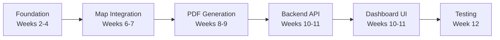
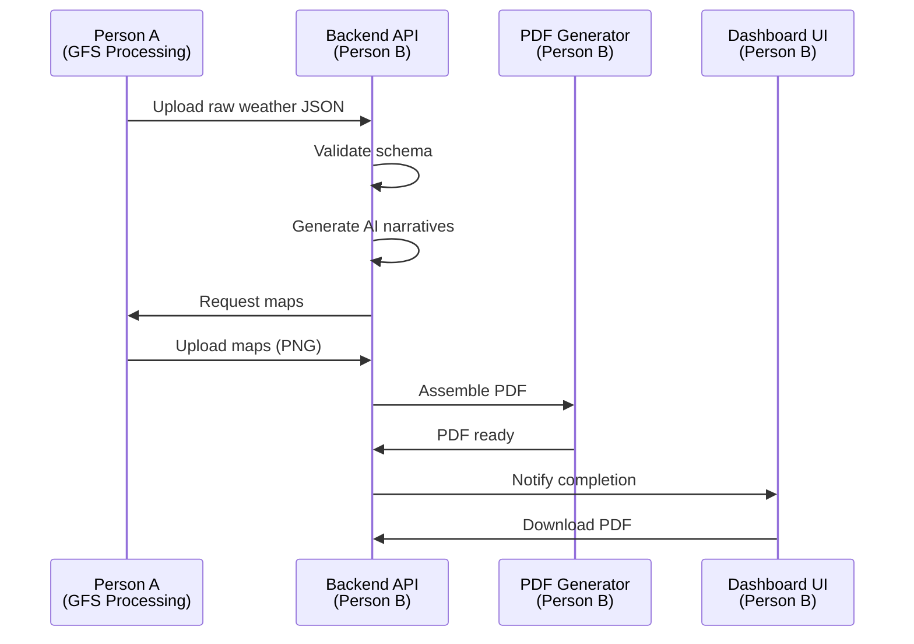

# Person B Implementation Plan
## Application & Reporting Engineer

This plan details Person B's tasks from the project timeline, mapped to specific implementation phases with clear integration points for Person A's geospatial work.

---

## Phase Overview



---

## Phase 1: Foundation - Data Interfaces & Schemas
**Timeline**: Weeks 2-4  
**Status**: ✅ Mostly Complete

### Completed
- ✅ JSON Schema definition ([schemas/county-weather-report.schema.json](schemas/county-weather-report.schema.json))
- ✅ Pydantic schemas ([backend/app/schemas/](backend/app/schemas/))
- ✅ Database models with proper relationships
- ✅ Base API structure

### Pending Tasks
1. **Validate schema compatibility with Person A's output format**
   - Ensure GFS processing outputs match schema exactly
   - Add schema validation tests
   - Document any edge cases or optional fields

2. **Create sample data fixtures**
   - Extend [pdf_generator/sample_data/nairobi_sample.json](pdf_generator/sample_data/nairobi_sample.json)
   - Add fixtures for multiple counties (coastal, highland, arid)
   - Include edge cases (missing wards, extreme weather)

**Deliverables**:
- Schema validation test script
- 5 comprehensive sample JSON files (Nairobi, Mombasa, Turkana, Nakuru, Kisumu)
- Updated schema documentation

---

## Phase 2: Map Embedding Strategy
**Timeline**: Weeks 6-7  
**Integration Point**: Person A delivers PNG/SVG maps

### Architecture Decision

Person A will generate maps as static image files:
- **Ward-level rainfall map** (PNG, 1200x900, 300 DPI)
- **County temperature map** (PNG, 1200x900, 300 DPI)  
- **Wind speed/direction map** (PNG, 1200x900, 300 DPI)

Person B will define:
1. File naming convention
2. Storage location strategy
3. Embedding method in PDFs
4. Fallback behavior for missing maps

### Implementation Tasks

#### Task 2.1: Define Map Storage Contract
Create `backend/app/services/map_storage.py`:
- Map naming: `{county_id}_{variable}_{period_start}_{period_end}.png`
- Storage path: `data/maps/{county_id}/{year}/{week}/`
- Metadata JSON: stores generation timestamp, bounds, quality flags

#### Task 2.2: Update PDF Builder for Image Embedding
Modify [pdf_generator/enhanced_pdf_builder.py](pdf_generator/enhanced_pdf_builder.py):
- Add `add_map_image()` method with proper scaling
- Handle missing images gracefully (placeholder text)
- Ensure DPI-appropriate sizing for print quality
- Add image compression for file size optimization

#### Task 2.3: Create Map Management API Endpoints
Extend [backend/app/api/v1/maps.py](backend/app/api/v1/maps.py) (new file):
```python
POST /api/v1/maps/upload          # Upload map image
GET  /api/v1/maps/{county_id}     # List maps for county
GET  /api/v1/maps/{map_id}/file   # Download map file
DELETE /api/v1/maps/{map_id}      # Delete map
```

#### Task 2.4: Integration Test Stub
Create placeholder for Person A integration:
- Mock map files in correct format
- Test PDF generation with maps
- Document expected map specifications

**Deliverables**:
- Map storage service with file management
- Enhanced PDF builder with image support
- Map API endpoints
- Integration documentation for Person A
- Sample placeholder maps

---

## Phase 3: PDF Layout & Branding
**Timeline**: Weeks 8-9  
**Current State**: Basic PDF generation works, needs professional polish

### Existing Components
- ✅ ReportLab-based PDF builder ([pdf_generator/pdf_builder.py](pdf_generator/pdf_builder.py))
- ✅ Enhanced builder with better formatting ([pdf_generator/enhanced_pdf_builder.py](pdf_generator/enhanced_pdf_builder.py))
- ✅ 11-section structure ([pdf_generator/section_generators.py](pdf_generator/section_generators.py))
- ✅ AI narrative generation working

### Enhancement Tasks

#### Task 3.1: Professional Layout System
Create `pdf_generator/layout_engine.py`:
- **Page template**: Header with Kenya Met Dept logo, footer with page numbers
- **Color scheme**: WMO-compliant colors for weather data visualization
- **Typography**: Professional font stack (DejaVu Sans for body, bold for headers)
- **Grid system**: Consistent margins, column layouts, whitespace

#### Task 3.2: Enhanced Section Rendering
Refactor [pdf_generator/section_generators.py](pdf_generator/section_generators.py):

**Section 1: Cover Page**
- County name + coat of arms (if available)
- Report period prominently displayed
- Generation date and report ID
- Kenya Meteorological Department branding

**Section 2: Executive Summary**
- Styled callout box with key highlights
- Traffic light indicators (🟢 normal, 🟡 watch, 🔴 warning)
- Condensed 2-3 paragraph AI summary

**Section 3: Weekly Overview**
- 7-day temperature/rainfall chart (embedded matplotlib figure)
- Daily breakdown table with styled cells
- Trend indicators (↑↓→)

**Section 4-6: Variable Deep Dives** (Temperature, Rainfall, Wind)
- **Map integration**: Full-page map with legend
- **Statistics table**: Styled with alternating row colors
- **Narrative text**: AI-generated with proper paragraph formatting
- **Historical comparison**: Mini chart showing vs. climatology

**Section 7: Ward-Level Details**
- Multi-page table with ward rankings
- Conditional formatting (highest rainfall highlighted)
- Pagination handling for counties with many wards

**Section 8: Extremes & Alerts**
- Alert boxes with icons
- Flood/drought risk indicators
- Wind speed warnings

**Section 9: Impacts & Advisories**
- Sector-specific guidance (agriculture, transport, health)
- Icon-based visual hierarchy

**Section 10: Data Sources & Methodology**
- Technical details in appendix format
- GFS model run information
- Quality flags and disclaimers

**Section 11: Contact Information**
- Kenya Met Dept contact details
- Report feedback mechanism
- QR code for digital version (optional)

#### Task 3.3: Chart Generation Service
Create `pdf_generator/chart_generator.py`:
- Matplotlib wrapper for consistent styling
- Temperature trend line charts
- Rainfall bar charts (daily accumulation)
- Wind rose diagrams
- Export as high-DPI PNG for embedding

#### Task 3.4: Brand Assets Integration
Organize assets in `pdf_generator/assets/`:
- `logo.png`: Kenya Met Dept logo
- `fonts/`: DejaVu Sans family
- `icons/`: Weather icons (sun, rain, wind, etc.)
- `colors.py`: WMO color palette constants

#### Task 3.5: PDF Optimization
Add post-processing in `pdf_generator/pdf_builder.py`:
- PDF/A compliance for archival
- Metadata embedding (author, keywords, creation date)
- File size optimization (image compression)
- Watermark for draft vs. final versions

**Deliverables**:
- Professional layout engine
- Enhanced section generators with full styling
- Chart generation service
- Brand assets organized and integrated
- Sample PDFs for all 5 test counties
- PDF quality benchmarks (file size < 5MB, generation time < 30s)

---

## Phase 4: Backend API Expansion
**Timeline**: Weeks 10-11  
**Focus**: Processing pipeline, automation scheduling, enhanced endpoints

### Current API State
- ✅ Counties: CRUD (read-only reference data)
- ✅ Weather Reports: Basic CRUD
- ✅ PDF Generation: Generate from complete report or raw JSON
- ⚠️ Missing: Pipeline orchestration, batch processing, scheduling

### Implementation Tasks

#### Task 4.1: Processing Pipeline Service
Create `backend/app/services/pipeline.py`:

**Pipeline stages**:
1. **Validate Input**: Check JSON schema compliance
2. **Generate Complete Report**: AI narrative generation
3. **Generate Maps**: Trigger Person A's map service (async)
4. **Assemble PDF**: Combine narratives + maps into PDF
5. **Store Artifacts**: Save to database + file storage
6. **Notify Completion**: Webhook or email notification

**Key features**:
- Retry logic for transient failures
- Progress tracking (0-100%)
- Cancellation support
- Audit logging

#### Task 4.2: Pipeline API Endpoints
Create `backend/app/api/v1/pipeline.py`:

```python
POST /api/v1/pipeline/process
  # Full pipeline: JSON → Complete Report → Maps → PDF
  Request: { county_id, period_start, period_end, raw_data }
  Response: { pipeline_id, status, progress, estimated_completion }

GET /api/v1/pipeline/{pipeline_id}/status
  # Check pipeline progress
  Response: { status, progress, current_stage, errors }

POST /api/v1/pipeline/{pipeline_id}/cancel
  # Cancel running pipeline

GET /api/v1/pipeline/history
  # List pipeline runs (paginated)
  Query: ?county_id=31&status=completed&limit=20
```

#### Task 4.3: Batch Processing Service
Create `backend/app/services/batch_processor.py`:

**Use case**: Generate reports for all 47 counties weekly

```python
POST /api/v1/batch/counties
  # Queue reports for multiple counties
  Request: { 
    county_ids: ["01", "02", "31"],
    period_start: "2026-01-27",
    period_end: "2026-02-02",
    priority: "normal"
  }
  Response: { batch_id, queued_count, estimated_duration }

GET /api/v1/batch/{batch_id}/status
  # Batch progress: 15/47 completed

POST /api/v1/batch/{batch_id}/cancel
```

#### Task 4.4: Scheduling Service (Celery Setup)
Set up `backend/app/tasks/` for asynchronous processing:

**File**: `backend/app/tasks/celery_app.py`
- Configure Celery with Redis broker
- Define task queues (high priority, normal, low)
- Health check tasks

**File**: `backend/app/tasks/report_tasks.py`
```python
@celery_app.task(name="generate_weekly_reports")
def generate_weekly_reports():
    """
    Scheduled weekly: Generate reports for all 47 counties.
    Runs every Monday at 00:00 UTC.
    """
    # Implementation

@celery_app.task(name="process_single_county")
def process_single_county(county_id, raw_data):
    """Background task for single county processing."""
    # Implementation
```

**File**: `backend/app/tasks/scheduler.py`
- Cron schedule definitions
- Celery Beat configuration
- Manual trigger endpoints

#### Task 4.5: Enhanced Report Endpoints
Extend [backend/app/api/v1/reports.py](backend/app/api/v1/reports.py):

**New convenience endpoints**:
```python
POST /api/v1/reports/{id}/process
  # Combines: create report → generate narratives → generate PDF
  # Replaces current 2-step workflow

GET /api/v1/reports/{id}/pdf
  # Alias for GET /api/v1/pdf/{pdf_id}/download
  # Convenience: find PDF by report ID

POST /api/v1/reports/bulk-generate
  # Generate multiple reports in one request
```

#### Task 4.6: Data Upload Endpoints
Create `backend/app/api/v1/uploads.py`:

**For Person A to upload processed data**:
```python
POST /api/v1/uploads/weather-data
  # Upload raw weather JSON (validates schema)
  Content-Type: application/json

POST /api/v1/uploads/maps
  # Upload map images (multipart/form-data)
  Files: rainfall_map, temperature_map, wind_map

POST /api/v1/uploads/grib-metadata
  # Upload GFS run metadata (for audit trail)
```

#### Task 4.7: Caching Layer
Create `backend/app/services/cache.py`:
- Redis-based caching for county lists, schema definitions
- Cache invalidation strategies
- TTL configuration (1 hour for reports, 24 hours for reference data)

**Deliverables**:
- Pipeline orchestration service
- Batch processing for multi-county runs
- Celery + Redis setup with scheduled tasks
- Enhanced API endpoints (8 new routes)
- Data upload endpoints for Person A integration
- Caching layer for performance
- API documentation updates (Swagger/OpenAPI)

---

## Phase 5: Dashboard UI Integration
**Timeline**: Weeks 10-11  
**Current State**: Frontend exists with mock data, needs backend connection

### Existing Frontend Structure
```
app/
  dashboard/page.tsx           # Main dashboard
  sign-in/page.tsx            # Auth (mock)
  sign-up/page.tsx            # Auth (mock)
components/screens/
  dashboard-overview.tsx      # Dashboard home
  data-upload.tsx            # Upload form (mock)
  manual-generation.tsx      # Generate report form (mock)
  county-detail.tsx          # County view (mock)
  report-archive.tsx         # Report history (mock)
  logs-diagnostics.tsx       # System logs (mock)
  system-configuration.tsx   # Settings (mock)
```

### Implementation Tasks

#### Task 5.1: API Client Library
Create `lib/api-client.ts`:

**Base client**:
```typescript
class ClimascopeAPI {
  private baseURL = process.env.NEXT_PUBLIC_API_URL || 'http://localhost:8000'
  
  // County methods
  async getCounties(): Promise<County[]>
  async getCounty(id: string): Promise<County>
  
  // Report methods
  async createReport(data: CreateReportRequest): Promise<WeatherReport>
  async getReport(id: number): Promise<WeatherReport>
  async listReports(filters: ReportFilters): Promise<PaginatedReports>
  async processReport(id: number): Promise<ProcessResponse>
  
  // PDF methods
  async generatePDF(reportId: number): Promise<PDFReport>
  async downloadPDF(pdfId: number): Promise<Blob>
  
  // Pipeline methods
  async startPipeline(data: PipelineRequest): Promise<Pipeline>
  async getPipelineStatus(id: string): Promise<PipelineStatus>
  
  // Batch methods
  async startBatch(countyIds: string[]): Promise<Batch>
  async getBatchStatus(id: string): Promise<BatchStatus>
}

export const api = new ClimascopeAPI()
```

**Error handling**:
- Network errors with retry logic
- 401/403 → redirect to login
- 422 → validation error display
- 500 → error toast with support contact

#### Task 5.2: Type Definitions from Backend Schemas
Create `types/api.ts`:
- Auto-generate TypeScript types from Pydantic schemas
- Use `openapi-typescript` or manual definitions
- Ensure JSON schema alignment

#### Task 5.3: React Hooks for Data Fetching
Create `hooks/use-api.ts`:

```typescript
// Query hooks using React Query / SWR
export function useCounties()
export function useCounty(id: string)
export function useReports(filters: ReportFilters)
export function useReport(id: number)
export function usePipelineStatus(id: string)

// Mutation hooks
export function useCreateReport()
export function useProcessReport()
export function useGeneratePDF()
export function useStartBatch()
```

#### Task 5.4: Connect Dashboard Screens

**Screen 1: Dashboard Overview** ([components/screens/dashboard-overview.tsx](components/screens/dashboard-overview.tsx))
- Replace mock data with `useReports()` hook
- Show recent report generation activity
- System status indicators (API health, Celery status)
- Quick stats (reports generated today/week/month)

**Screen 2: Manual Report Generation** ([components/screens/manual-generation.tsx](components/screens/manual-generation.tsx))
- Form validation with Zod (match backend schema)
- County dropdown from `useCounties()`
- Date range picker (7-day period validation)
- JSON upload for raw weather data
- Real-time progress indicator during pipeline
- Success → redirect to report detail page

**Screen 3: Data Upload** ([components/screens/data-upload.tsx](components/screens/data-upload.tsx))
- File upload for JSON weather data
- Drag-and-drop interface
- Schema validation preview before submit
- Batch upload for multiple counties
- Upload history table

**Screen 4: County Detail** ([components/screens/county-detail.tsx](components/screens/county-detail.tsx))
- County info from `useCounty(countyId)`
- Recent reports for this county
- Generate new report button
- Download past PDFs
- Ward list (if Person A provides ward boundaries)

**Screen 5: Report Archive** ([components/screens/report-archive.tsx](components/screens/report-archive.tsx))
- Paginated table using `useReports()`
- Filters: county, date range, status
- Download PDF button per row
- Delete report (confirmation dialog)
- Bulk actions (delete multiple, regenerate)

**Screen 6: Logs & Diagnostics** ([components/screens/logs-diagnostics.tsx](components/screens/logs-diagnostics.tsx))
- Real-time log streaming (WebSocket or polling)
- Pipeline execution logs
- Error logs with stack traces
- System health metrics

**Screen 7: System Configuration** ([components/screens/system-configuration.tsx](components/screens/system-configuration.tsx))
- Celery schedule configuration
- Weekly auto-generation settings
- AI provider selection (OpenAI/Anthropic)
- Email notification settings
- PDF branding customization

#### Task 5.5: Authentication Integration
Update [app/sign-in/page.tsx](app/sign-in/page.tsx) and [app/sign-up/page.tsx](app/sign-up/page.tsx):
- Connect to backend auth endpoints (if Person A implements)
- Session management with JWT
- Protected routes middleware
- Role-based access (admin, viewer)

#### Task 5.6: Real-Time Updates
Add WebSocket or SSE for live updates:
- Pipeline progress (0% → 100%)
- Batch processing status (15/47 completed)
- New report notifications
- System alerts

**Deliverables**:
- Complete API client library
- Type-safe React hooks for all endpoints
- 7 dashboard screens connected to backend
- Real-time progress indicators
- Error handling and loading states
- Responsive UI (mobile-friendly)
- E2E user flow testing

---

## Phase 6: Testing & Integration
**Timeline**: Week 12  
**Focus**: UX testing, Person A integration, documentation

### Testing Tasks

#### Task 6.1: Integration Testing
Create `backend/tests/integration/`:
- **test_full_pipeline.py**: End-to-end report generation
- **test_batch_processing.py**: Multi-county batch runs
- **test_map_integration.py**: Map upload → PDF embedding
- **test_api_endpoints.py**: All endpoints with real database

#### Task 6.2: Frontend E2E Tests
Create `e2e/`:
- Playwright tests for critical user flows
- **Test 1**: Login → Generate Report → Download PDF
- **Test 2**: Upload Weather Data → Validate → Process
- **Test 3**: View Report Archive → Filter → Delete
- **Test 4**: Batch Generate (5 counties) → Monitor Progress

#### Task 6.3: Performance Testing
- Load test: 47 concurrent county reports
- Database query optimization (N+1 problem checks)
- API response time benchmarks (< 200ms for GET, < 2s for POST)
- PDF generation time (target: < 30s per county)

#### Task 6.4: Person A Integration Handoff
**Integration contract document**:
1. **Data Exchange Format**
   - JSON schema validation rules
   - Sample payloads for each variable
   - Error response formats

2. **Map Delivery**
   - File naming convention
   - Image specifications (resolution, format, DPI)
   - Upload API usage guide

3. **Synchronization**
   - How Person A triggers Person B pipeline
   - Webhook for completion notifications
   - Shared Redis queue (optional)

4. **Debugging**
   - Shared logging format
   - Error code ranges (A-xxx vs B-xxx)
   - Support contact points

#### Task 6.5: UX Testing
- User acceptance testing with Kenya Met Dept staff (if available)
- Usability testing: 5 users complete 3 tasks
- Accessibility audit (WCAG 2.1 Level AA)
- Mobile responsiveness testing

#### Task 6.6: Documentation
**User documentation**:
- `docs/USER_GUIDE.md`: How to generate reports
- `docs/ADMIN_GUIDE.md`: System configuration
- Video walkthrough (5-10 minutes)

**Developer documentation**:
- `docs/API_REFERENCE.md`: All endpoints with examples
- `docs/DEPLOYMENT.md`: Production setup guide
- `docs/INTEGRATION.md`: Person A + Person B handoff

**Deliverables**:
- 20+ integration tests (80%+ coverage)
- 10+ E2E tests for frontend
- Performance benchmarks met
- Integration contract document for Person A
- Complete user and developer documentation
- Deployment runbook

---

## Integration Points with Person A

### Data Flow


### Handoff Checklist
- [ ] JSON schema finalized and versioned
- [ ] Map specification document (format, resolution, naming)
- [ ] API endpoints for data upload tested
- [ ] Sample data exchange successful
- [ ] Error handling protocols defined
- [ ] Monitoring and alerting configured
- [ ] Integration tests passing with mock Person A data

---

## Success Criteria

### Phase 1-2 (Foundation)
- ✅ 5 sample JSON files validated against schema
- ✅ Map storage service operational
- ✅ Integration documentation complete

### Phase 3 (PDF Generation)
- ✅ Professional PDFs generated for all 5 test counties
- ✅ File size < 5MB, generation time < 30s
- ✅ Maps embedded correctly with fallbacks

### Phase 4 (Backend API)
- ✅ Pipeline processes county report in < 60s (excluding map gen)
- ✅ Batch processing handles 47 counties in < 30 minutes
- ✅ Celery weekly schedule operational
- ✅ 8+ new API endpoints documented

### Phase 5 (Frontend)
- ✅ All 7 dashboard screens functional
- ✅ No mock data remaining
- ✅ Real-time progress indicators working
- ✅ Mobile-responsive UI

### Phase 6 (Testing)
- ✅ 80%+ test coverage (backend)
- ✅ 10+ E2E tests passing
- ✅ Person A integration successful
- ✅ Documentation complete

---

## Risk Mitigation

### Risk 1: Person A Delays
**Mitigation**: Develop with mock map files matching exact specifications. Integration should be plug-and-play.

### Risk 2: AI API Costs/Rate Limits
**Mitigation**: 
- Implement caching for repeated narratives
- Support multiple AI providers (OpenAI, Anthropic, local LLM)
- Pre-generate narratives during off-peak hours

### Risk 3: Large PDF File Sizes
**Mitigation**:
- Image compression (PNG → optimized JPEG for photos)
- PDF linearization for fast web viewing
- Separate "print quality" vs "web quality" versions

### Risk 4: Scaling to 47 Counties Weekly
**Mitigation**:
- Horizontal scaling with Celery workers
- Database connection pooling
- Redis caching for repeated queries
- Asynchronous processing throughout

---

## Technical Stack Summary

### Backend Additions
- **Celery**: Distributed task queue
- **Redis**: Message broker + caching
- **Pytest**: Testing framework
- **FastAPI Background Tasks**: For quick async operations

### Frontend Additions
- **React Query** or **SWR**: Data fetching/caching
- **Zod**: Runtime schema validation
- **Playwright**: E2E testing
- **Socket.io** (optional): Real-time updates

### DevOps
- **Docker Compose**: Multi-container setup (FastAPI, Postgres, Redis, Celery)
- **Nginx**: Reverse proxy (optional)
- **Sentry**: Error monitoring (optional)

---

## Timeline Summary

| Week | Phase | Deliverables |
|------|-------|-------------|
| 2-4 | Foundation | Schema validation, sample fixtures |
| 6-7 | Maps | Map storage service, integration docs |
| 8-9 | PDF | Professional layout, brand assets, 5 sample PDFs |
| 10-11 | Backend | Pipeline, Celery, 8 new API endpoints |
| 10-11 | Frontend | API client, connected screens, real-time UI |
| 12 | Testing | Integration tests, E2E tests, Person A handoff, docs |

**Total Duration**: ~10 weeks of focused development

---

## Next Steps

1. Validate this plan with Person A's timeline
2. Confirm map specifications and delivery format
3. Begin Phase 1 remaining tasks (schema validation)
4. Set up development environment (Docker, Redis, Celery)
5. Create project board with all tasks tracked